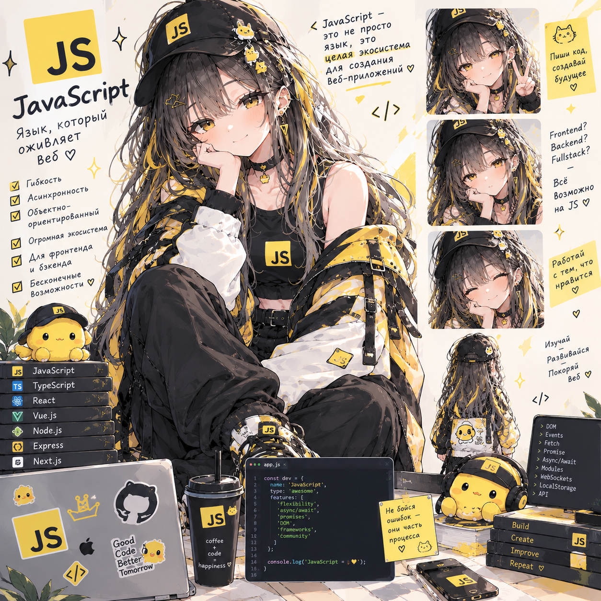

# Чистый JS Lab — Vanilla Helpdesk

**Статус: ⚪ методичка готова, прохождение впереди.**
**Сложность: средняя.** Не требует предыдущих лаб — нужен только базовый синтаксис JS. Полезно проходить до Vue Lab и TypeScript Lab: это их общий фундамент.

## О чём

Чистый JavaScript с нуля, без единого фреймворка и без бандлера — то, что Vue и другие фреймворки обычно прячут: как на самом деле работают `var`/`let`/`const` и hoisting, `this` и замыкания, прототипы под капотом `class`, event loop и очередь микро/макрозадач, DOM и модули. Домен практики (тикеты) намеренно совпадает с [Vue Lab](https://github.com/meeymirita/vue-lab), чтобы в финале явно сравнить «vanilla vs Vue» — код при этом полностью свой, без единой связи с тем репозиторием.

## Стек

JavaScript (ES2022+, без TypeScript и без сборки) + Node.js 22 для сессий-песочниц; в браузере — нативные ES-модули без бандлера; `json-server` как мок-API (только `db.json`, ноль кода); собственный ~15-строчный сервер на `node:http` вместо Express/serve; тесты — встроенный `node --test`.

## Формат

Методичка [`JS_Lab_VanillaHelpdesk.html`](JS_Lab_VanillaHelpdesk.html) — открывается в браузере, прогресс по чекбоксам сохраняется локально.

## Что внутри

- **Язык и рантайм (разделы 1–9)** — типичные баги от непонимания фундамента; область видимости и hoisting; типы и приведение; объекты/массивы (деструктуризация, spread/rest, методы); `this`, `call/apply/bind`, замыкания и паттерны (каррирование, мемоизация, `#private`); прототипы и `class`; `Symbol`, `Map`/`Set`/`WeakMap`/`WeakSet`; event loop (call stack, micro/macrotask); callback → Promise → `async/await`
- **Асинхронность и браузер (разделы 10–14)** — `fetch`, `AbortController`, debounce/throttle руками; DOM без фреймворка (обход дерева, делегирование событий); модули (ESM vs CommonJS vs бандлер); `localStorage`/`structuredClone`; своя мини-реактивность на `Proxy`
- **Задания (8 сессий)** — от воспроизведения классических багов (var в цикле, потеря `this`) через рефакторинг на методах массивов, паттерны замыканий, прототипы/class, event loop и fetch, DOM без фреймворка — до финальной сборки мини-SPA (свой роутер на `history.pushState`, стор на `Proxy`, рендер шаблонными строками) с явной таблицей сравнения «что Vue даёт бесплатно»
- **Справочные разделы (15–20)** — стек и структура проекта, чек-лист «концепция ↔ код», глоссарий, вопросы для собеседования, что дальше (Vue Lab, TypeScript Lab, генераторы, Web Components, virtual DOM своими руками)

---

Часть сборного репозитория лабораторных работ — [submodule-group-lab](https://github.com/meeymirita/submodule-group-lab).
